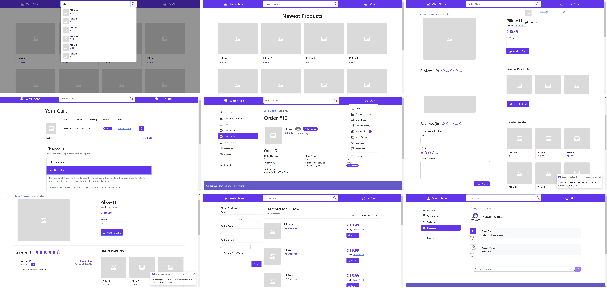

# Toy App - "Web Store"

This is a tiny simple PHP (Codeignitor 4) / Bootstrap 5 / Vanilla JS website (tier 3 app) that I ended up making within the scope of a course I've taken. 

I thought it was polished enough (read: visually pretty enough & having enough, though basic, features to explore) to put it up on my personal page, because why not? 


#### Preview 

For a [set of preview screenshots](./preview/), please refer to the readme in [`./preview/`](./preview/).

[](./preview/)

## Running

#### Prerequisites:
- [docker](https://docs.docker.com/)
- [docker-compose](https://docs.docker.com/compose/install/)
- [composer](https://getcomposer.org/download/)


#### Running:

Ensure there is a `./codeigniter/.env` file, derived from [`./codeigniter/env`](./codeigniter/env).
The bare minimum are these properties being set:

```
database.default.hostname = localhost
database.default.database = app
database.default.username = root
database.default.DBDriver = MySQLi
database.default.DBPrefix =
database.default.port = 3306
```

Then from the root folder:

```
cd ./codeigniter
composer install
```

In the root folder:

```
docker-compose build
```

```
docker-compose up
```

#### Initialisation /Seeding

To initialise the database with some basic test data, create a database `app` (or whatever name was configured in the `.env` file) in the container and then send a get request to `/seed`
or use the command line seeder as [described here](https://codeigniter4.github.io/CodeIgniter4/dbmgmt/seeds.html#command-line-seeding)

The database (assuming recent version of docker and container running):

```
docker container exec webprogramming_proj-app-1 mysql -uroot -e "create database app"
```
Or replace `webprogramming_proj-app-1` with the container ID.


The seeder name is `AppSeeder`. So e.g.
```
php spark db:seed AppSeeder
```

## Test Accounts (seeded)

#### Regular user account:
```
Username: bob@test.test
Password: myPassword123
```

#### Store owner 1:
```
Username: store@test.test
Password: anotherPasswrod323
```

#### Store owner 2:
```
Username: gsms@test.test
Password: anotherPasswrod323
```

#### Store owner 3:
```
Username: electronica@test.test
Password: anotherPasswrod323
```

#### Store owner 4:
```
Username: tvs@test.test
Password: anotherPasswrod323
```